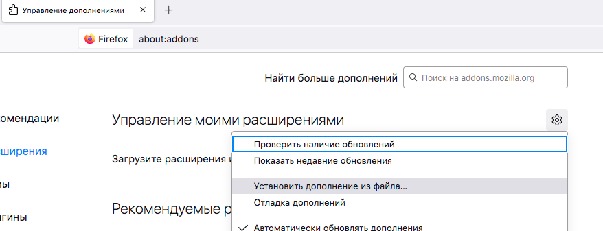
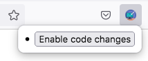

# gScreenshoter
Extension for Firefox browser
Changes some css stiles on Grafana page for making long screenshots with browser tool
# Installation 
Follow [this](https://extensionworkshop.com/documentation/develop/temporary-installation-in-firefox/) official guide for temporary installation
Use self-signed xpi file for permanent installation here

# Usage
Open dashboard page, expand all needed tabs, chose time interval etc...
Open extension tab and press Enable code changes

Create screenshot, pressing RMC and chosing screenshot option
